###### Requirements: VIM on VSC extension.
# [LiveDemo](https://rroderickk.github.io/vimVSC_cheatSheet/)

<h2>Lo mas difícil de dominar es el movimiento inicial con las teclas 
  h j k l <i>-Para es este juego-</i>
  Una vez lo logras el resto es <b>PAN COMIDO</b>....
</h2>
<small style="font-size: 17px;">Por supuesto hay otros movimientos añadidos que descubriras leyendo este post</small> 
<small style="font-size: 17px;">El unico requerimiento es tener instalada la extension VIM on VSC</small>

<h2>Combo1: Pasitos de tortuga </h2>

Una vez que domines el movimiento tortuga ya estaras listo para empezar a hackear los movimientos y moverte modo liebre, guepardo o gokú teletransportandote.

Nota: La idea principal es asociar o referenciar los comandos como &ensp; 
   dt<  &ensp; hacia lo que quieres hacer por medio de la via corta, en este caso en ingles significa: delete until <   &ensp; eliminar hasta < 

Así los comandos quedan INTERIORIZADOS para siempre.

  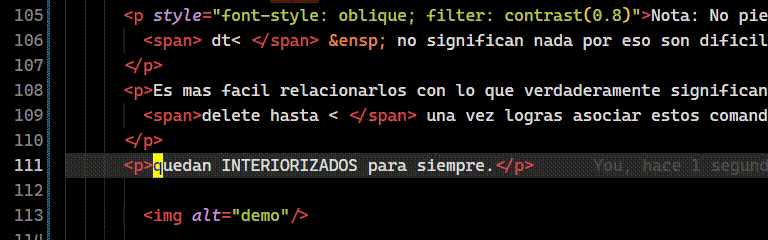

Puedes ver lo poderoso que es?, entonces empecemos con los movimientos por palabras, si como su nombre lo dice palabras en ingles words que es diferente a  WORDS  jejejej si puedes ir haciendote la idea que la velocidad de movimiento cambia si presionamos w o W a su vez si queremos ir hacia atras usamos la b o B que en ingles es back

  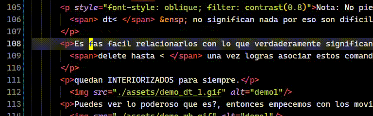

<h2>Combo2: Movimiento horizontal, busqueda</h2>

Dentro de la misma linea horizontal puedes avanzar a caracteres especificos con la palabra find osea la tecla f puedo moverme buscando los espacios con el comando f space o retrocediendo F space con eso es suficiente para entender la dinamica. f{caracter} |or|  F{caracter}.

  f. find . 
  f( find ( 
  f/ find / F/ Find / 

  

  Nota: Siempre hay dos sentidos, infinidad de comandos posibles.

<h2>Combo3: Inicio y final de linea horizontalmente </h2>

  0 inicio  
  $ final  
  % Saltar a la coincidencia ({[]}).  

Letra Inicial - Letra final en modo insertar 

  I i mayuscula -> Inicio  
  A Al final  

  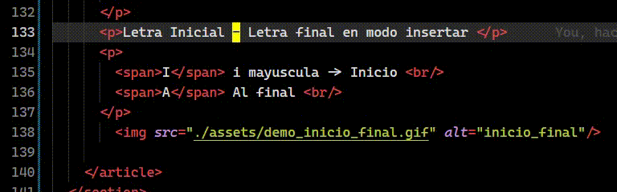

<b>VIMotion</b> tiene tres modos, cursor - insertar - seleccionar 
y como todos insertar tene dos sentidos i, I y a A. 

  i tecla i   
  a tecla a  
  o open linea debajo  
  O Open linea arriba  

  
  
<b>Felicidades: ya tiene lo suficiente para moverse en modo liebre.</b>

<h2>Combo4: Movimiento vertical como guepardo </h2>

Fast Movement 

Nota: aqui ya eres libre de decidir como relacionar las teclas con tu forma de pensar 

  ( ) fast vertical movement   
  { } fast vertical movement  

  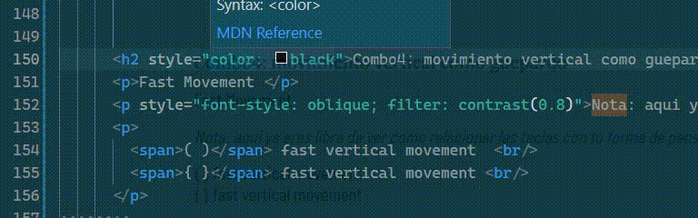

<h2>Combo5: Movimientos verticales de alta precisión con patrón de búsqueda </h2>

Busqueda hacia arriba o hacia abajo

  /{palabra a buscar hacia abajo} Ejemplo: /Nota   
  ?{palabra a buscar hacia arriba} Ejemplo: ?Busqueda  
  n next, siguiente ocurrencia de busqueda  
  N next, anterior ocurrencia de busqueda  

Busqueda hacia arriba o hacia abajo

  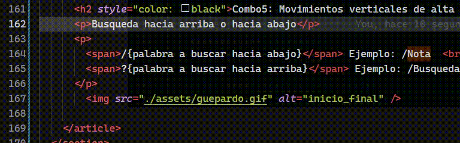
  

<h2>T1: linea 0 -> cualquier linea - verticalmente</h2>

  <!-- gg -->
  gg gugol gugol,te lleva a la linea cero o inicio del documento  
  G al final  
  gg{numero_de_linea}G linea exacta  
  gg100gg tambien funciona y te lleva a la linea 100  
  gg50enter lo mismo -> linea 50  
  ggdG <b>Elimina todo el documento </b> 

   

<h2>T2: Movimiento 3D </h2>

  <b>gd</b> Go to definition de mis favoritos y mas usados 
  alt + ArrowLeft Devolver 
   
  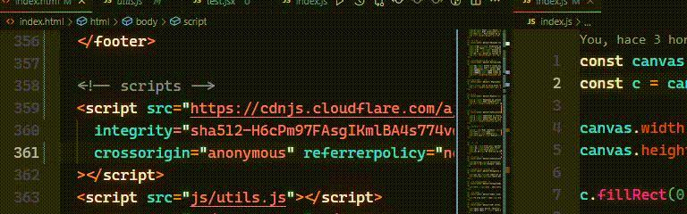 
   
  gf Get file 
   
  

<h2>Editando texto: Modo hardcore</h2>

  <b>dd</b> Elimina toda la linea -delete- 
  yy Copia toda la linea -yank- 
  p Pegar Paste 
  v Modo seleccionar 
  Esc Para escapar de la mayoria de los comandos y te situa en modo movimiento - cursor 

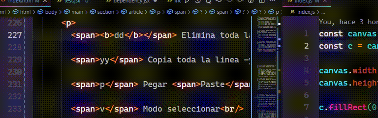 

<h2>Editando texto: Modo hardcore</h2>

  <b>de</b> Eliminando palabras 
  <b>dt space</b> Eliminando hasta el espacio 
  <b>dt / </b> Elimina hasta el / 
  <b>dt ' </b> Elimina hasta la ' 
  dB delete en sentido contrario delete back 

  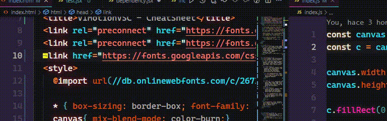 

<h2>Multiplicadores</h2>

  4dj Delete 4 lineas hacia abajo  
  4yk yank 4 lineas hacia arriba 
  d1000enter delete 1000 lineas  
  10000dd 10000 lineas delete 
  10000yy 10000 lineas yank -copy- 

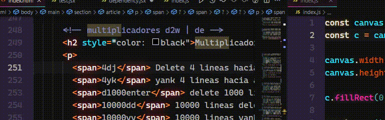 

<h2> Replicador</h2>

  . con la tecla punto replica último cambio 

 

<h2>Replace</h2>

  r  Reemplaza el caracter debajo del cursor 
  R  Modo reemplazar 

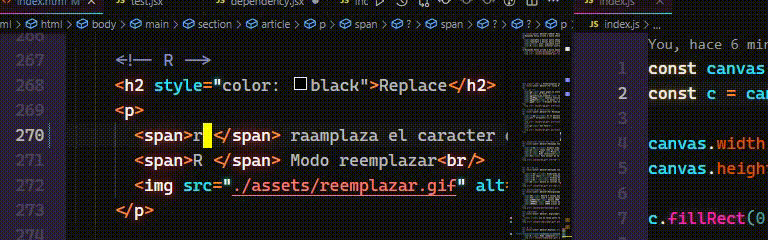 

<h2>Substitusion</h2>

  s  Substituye el caracter debajo del cursor 
  S  Substituir toda la linea 
  D  Delete resto de linea 

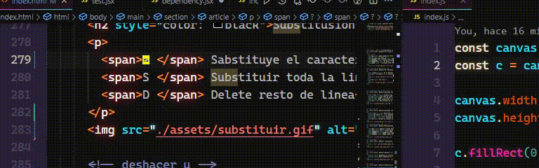 

  u Undo -deshacer-  
  ctrl z Undo 
  ctrl r Rehacer 
  ctrl shif z Rehacer 

<!-- :w  -->

  :wq  Write quit -guardar salir-  
  :wq!  Write quit forzar  
  :q!  Force quit 
  esc ZZ  Mi favorita la salida del zorro 

<h2>Substitusion en todo el documento</h2>

  :%s/w/s/g  :%s sustitucion /word a substituir /substucion /g aplicar cambios a todas las ocurrencias 
  :%s/"/'/g Ejemplo: substituye todas las comillas dobles por comilla simple 

   

<h2>Emmet: wrap</h2>

  f1 wrap enter + namewrap with etiqueta 

   

<h2>Indentacion</h2>

   >  -> Empuja hacia la derecha  
   <  <- Empuja hacia la izquierda 
   <.  <- Empuja hacia la izquierda y replica 

   

<h2>VIM: motion</h2>

  space space motion  objetivo si tienes habilitada esta opcion con la combinacion de teclas 2 veces espacio y una direccion jklm entras en modo leader VSC te resaltara las opciones precisas a donde quieres ir 
  space space u , space space arriba y al objetivo , me situara allí 

   

<h2>Navegacion en pestañas o grupo</h2>

  alt 2  alt numero de pestaña 
  ctrl 2  ctrl numero del grupo de pestaña 

   

<h2>Autoguardado</h2>

  ctrl , ctrl , abre settings de VSC y en el primer apartado AutoSave escoger afterDelay 

<h3>Si tienes otro hack no dudes en comunicarlo</h3>
   

<h2>Por supuesto la destreza se adquiere practicando con el poco tiempo veras como tu cerebro crea las conexiones necesarias para que tus manos hagan lo que tu desees sin pensarlo.
    habran errores mientras mas practiques la precision y conexion ojo -> cerebro -> mano -> aumentara...</h2> 
<h4> Si quieres aprender a hacer juegos como este te recomiendo este video:
  <a href="https://www.youtube.com/watch?v=vyqbNFMDRGQ" target="_blank">
    JavaScript Fighting Game Tutorial with HTML Canvas
  </a> de este canal:
  <a href="https://www.youtube.com/c/ChrisCourses" target="_blank">
    Chris Courses </a>
</h2>

<a href="https://twitter.com/cheatmodes4" target="_blank" style="text-decoration: none;">
<h3 style="text-align: center; margin: 60px 0 80px">
  

  
   by CheatModes4 - rroderickk </h3>
</a>
