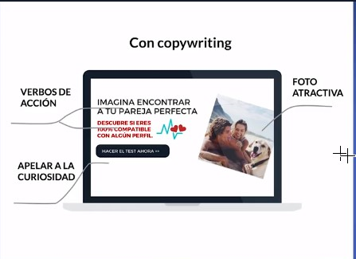
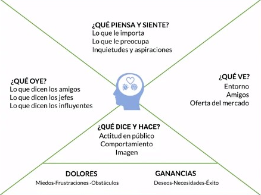
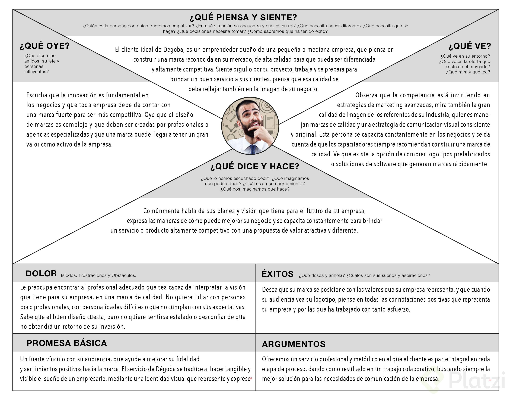

### Copyriting
Es escribir para internet usando técnicas de redacción publicitaria que tienen por objetivo generar que el público haga una acción, que muchas veces será comprar nuestro producto. Cuando hacemos Copywriting vamos a estar constantemente persuadiendo a nuestros lectores con palabras.

<p align="center">
  
</p>

> Verbos de accion call to action:
  - incitan a la accion que realice algo: imagina,descubre, ahora.
> Apelar a la curiosidad
> Foto atractiva: pareja perfecta, playa, y puedes conseguir esto. 


##### Storytelling
La manera en que contamos historias de forma tal que podemos transmitir un mensaje al conectar con nuestra audiencia. Se puede hacer no solo escribiendo sino también de mil maneras distintas. Con esto nosotros crearemos emoción para enganchar al público.


##### Voz de marca
Tanto en el curso de Storytelling como en el de Estrategias para la creación de contenido vimos que para crear contenido vamos a tener 3 círculos: Why, How, What.
Allí aprendí que el Why es el más importante porque es el que te da las razones para hacer lo que haces y sin importar cuales sean siempre habrán otras cosas que se relacionen y así con las mismas razones o valores podrás hacer muchas cosas en diferentes formatos.
Yo creo la voz de marca es el comportamiento de una marca que va en consonancia con su Why, sus valores y a partir de allí acomoda toda la forma en la que crea su contenido (ya sea publicitario o no). Eso fue lo que entendí.

##### Territorio de marca
El espacio en el que se desenvuelve una marca a nivel emocional. Si tu marca quiere que la asocien con unos valores concretos pues ese será su territorio (aunque supongo que el producto o servicio a vender también influyen). Para esto hay que saber más que nada de Storytelling.


##### Propuesta de valor
Es lo que hará que el público te prefiera antes que a otros. Para esto se suelen usar las características, ventajas y beneficios

## Proyecto
> Pagina de inicio

> Subscripcion captacion de leads

> Sobre mi / nosotros

> Seccion de servicios

> Seccion de contacto


### 7 Fases para escribir

1. Documentacion
  > Todo el texto

2. Investigacion
  > Sacar las mejores ideas a un nuevo documento en blanco

3. Analisis
  > Leer en voz alta y escoger lo que suene mejor

4. Inspiracion
  > Profesionales en otro pais, buscar ejemplos

5. Redaccion
  > Completar los huecos de lo que se quiere decir (usar el trabajo previo)

6. Correccion
  > Ir perfeccionando el texto de los borradores

7. Testeo
  > Para probar si funciona o no.


###### Tener seccion de notas

### Mapa de empatia
<p align="center">
  
</p>

```sh
Sirve para identificar lo que ve,oye,piensa,y siente un cliente 
Los clientes siempre compran por miedo…
Ah caray… Eso explica muchas cosas
--------------
Para un podcast de salud mental…
No vendo un podcast de salud mental, me compran inspiración para mejorar cada día sus vidas.
---------------
YO NO VENDO MARKETING DIGITAL
Me compran innovación, posicionamiento de sus empresas, liderazgo competitivo, alcance de sueños, soluciones a sus necesidades como empresas y diferenciación
----------
yo no vendo Cafe, vendo momentos junto a tu familia
No vendo Cafe, vendo abrazos atrapados en una taza.
--------------
-No vendemos servicios de desarrollo web, diseño gráfico, marketing, etc. Nos compran la facilidad de estar /llevar negocios a Internet.

-No vendemos cursos y educación, nos compran curiosidad, mejora financiera(conseguir empleo en tecnología), la satisfacción de aprender, crea e inventar algo nuevo

--------------
Yo no tengo un proyecto empresarial, pero estoy en el fortalecimiento personal como profesional, dejo el resultado de este ejercicio y valoraría mucho feelback

Que vendo

No vendo dibujos / Vendo mundos fantásticos

No vendo diseños / vendo la forma de visualizar tus proyectos antes de invertir en su creación

No vendo infografías / vendo una forma de simplificar conceptos complejos

No vendo imagenes para aplicaciones / vendo experiencias de usuarios en tus proyectos

No vendo logos / vendo una visión estructurada de tu marca

Que me compran

Me compran la capacidad de adaptar diferentes disciplinas de la comunicación y la tecnología en el cumplimiento de objetivos

Me comparan el fortalecimiento constante de su marca

Me comparan la facilidad de mostrar conceptos complejos que puedan leerse fácilmente

-------------

no vendo servicios de marketing digital
me compran crecimiento, posicionamiento, generación de comunidades, bienestar de negocio.
Ayudo al empresario a potenciar sus ingresos
-----------
Para un blog de historias cortas y reflexiones:

Yo no vendo historias y reflexiones del mundo, vendo nuevos mundos y la curiosidad por descubrirlos.

Ellos me compran curiosidad por el mundo.
Ellos me compran generación de emociones (intriga, dolor, tristeza, sorpresa, etc.).
Ellos me compran para reflexionar más profundamente sobre el mundo.

Ayudo a ávidos consumidores a alimentar su curiosidad por el mundo y por conocer nuevos mundos.
-----------------

RESUMEN:
Hay que escuchar a ese potencial cliente.
Hay que saber que quiere que piensa.
Para elaborar el mapa de empatía se basa en los dolores y ganancias.
Un mapa de empatía sirve para identificar:
Lo que oye, lo que dicen los amigos, los jefes los influyentes.
Lo que piensa y siente, lo que le importa preocupa y sus inquietudes y aspiraciones.
Lo que ve, su entrono, amigos, la oferta del mercado.
Lo que dice y hace, actitud en público, comportamiento, su imagen.
No se puede responder de manera general sino que siempre debes responder a la pregunta inicial: ¿Cómo se relacionan esas preguntas en relación a mi producto o servicio?
¿Por qué nos interesan tanto sus dolores (miedos, frustraciones y obstáculos) y ganancias (deseos, necesidades y éxito)?
Porque cuando escribimos textos de venta cubrimos esos puntos.
El cliente compra siempre por miedo y para conseguir algo.
No vendemos, nos compran; no vendas bar, vende estar vivo. no vendas cine, vende salir de casa.
-------------
Vaclick Colombia no vende servicios de consultoría, ayudamos a las empresas en su desarrollo y crecimiento estratégico mediante la conexión de las mismas con sus entornos internos y externos de forma sencilla, lúdica, dinámica y perdurable en el tiempo
------------
Respecto a los Dolores y Ganancias, es determinar los miedos que siente nuestro cliente para decidir si comprar o no nuestro producto? Y en las ganancias sería ¿Qué ganaría nuestro cliente que compra nuestro producto y cómo se sentiría?

Estoy abierto a recomendaciones y me parece muy valiosa tu opinión.
--------------
auditorias ambientales me compran conciencia medioambiental, cumplimiento de las leyes, sustentabilidad
--------------
No siempre el cliente compra por miedo, puede comprar otros motivos:

Placer/Gusto.
Obligación.
Necesidad.
Emoción/Sentimientos.
De hecho, esto podría hacer referencia en el mapa de empatía en el apartado de GANANCIAS, pero no se menciona en el video.
--------------
No vendo mentorías a universitarios, me compran un futuro profesional exitoso.
--------------
Yo no vendo horas de trabajo…
Ellos compran:
Compromiso
Soluciones
Buena actitud
Punto de vista crítico
Experiencia en otros campos
Recursividad
Entusiasmo
Optimismo
Crecimiento
Tranquilidad
--------------
No vendo comida rápida, me compran un momento entre amigos o familia en un entorno distinto al clásico local de comida rápida, vendo la experiencia de comer en la naturaleza
--------------
No vendo desarrollo de aplicaciones, vendo soluciones tecnológicas para solucionar los problemas que tiene alguna empresa. Mejorar y optimizar sus procesos. 
--------------
Con respecto a consultaría de software para finanzas:

No vendo automatización de procesos - me compran tiempo libre

No vendo consultoría de software - me compran soluciones a sus problemas

No vendo herramientas de software - me compran hacer su vida más fácil
--------------
Para una empresa de micro crédito

No vendo crédito, vendo crecimiento
No vendo crédito, vendo esperanza en el futuro
No vendo tasas bajas, vendo confianza
No vendo crédito, vendo libertad
--------------
No vendemos Seguros de Vida/Medicina
Nos compran:

tranquilidad
futuro controlado
prevención
legado para mi familia
--------------
No vendo asesoria en criptomonedas.
Vendo libertad en las finanzas personales y de negocios.
Vendo seguridad, claridad y eficiencia en las transacciones de empresas.
--------------
No vendo paginas web, creo experiencia para que tu producto inspiré y deseen adquirirlo, sin dejar de lado el valor de tu marca y tu voz de marca, proporcionando herramientas y metodologías para crear producto nuevos y distintos.
--------------
📌| En resumen: Saber usar el mapa de empatía te sirve para identificar que oye, piensa, siente, dice y hace un potencial cliente o grupo de personas en concreto. El mapa de empatía está estructurado con 4 preguntas conformadas cada una con 3 preguntas más. Todas las preguntas la debes de contestar de manera específica y no de manera en general. Y recuerda, no vendemos, nos compran.
--------------
No vendo servicios de diseño web,
Me compran presencia digital, autoridad corporativa, confianza de marca, mejores conversiones, diferenciación de mercado.
--------------
Un mapa de empatía te sirve para identificar lo que oye, piensa, siente, dice y hace un potencial cliente o grupo de personas en concreto.

Un mapa de empatía está estructurado por 4 secciones según las preguntas que necesitamos responder:

¿Qué oye?
¿Qué piensa y siente?
¿Qué ve?
¿Qué dice y hace?
Todas estas preguntas las debes de contestar en relación a tu producto, no deben ser contestadas de manera general.

Recuerda: No vendes, te compran.
--------------
Yo no vendo cursos, ellos me compran un recorrido al mundo de la tecnología y el acompañamiento en sus primeros pasos
--------------
Yo no vendo masajes
me compran bienestar para mejorar calidad de vida
me compran tranquilidad
Yo no vendo depilación
me compran estar guapos
me compran estar higiénicos y limpios
me compran presencia
--------------
No vendemos, nos compran:

Los mejores gimnasios no venden “una maquina para hacer ejercicio”… “Venden” inspiración, salud, bienestar, energía…
Los mejores hoteles, aerolíneas y agencias de viajes no venden viajes… “Venden” recuerdos y experiencias…
🤓 Platzi no vende “cursos en línea”… Platzi “vende” formación online en Tecnología… Mucho nuevo conocimimiento… Crecimiento profesional… Tu futuro empleo o un mejor sueldo/trabajo… La mejor comunidad de estudiantes… Y muchas otras cosas…

💚 Todo esto por Nunca Parar de Aprender…
--------------
```

# A que tiene miedo el cliente que intenta comprar estos servicios
<p align="center">
  
</p>

